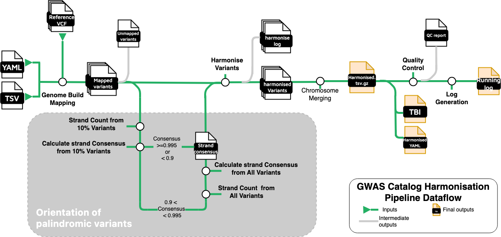

# Overview of the Harmonisation Pipeline

The `gwas-sumstats-harmoniser`  is a pipeline designed to standardise variant data across different genome assemblies, ensuring consistency for downstream analysis. This process involves four key steps:

1. Genome Build Mapping: Lifting variants to the desired genome assembly (GRCh38) to align genomic positions to a unified coordinate system.

2. Palindromic Variant Orientation: Inferring strand orientation of palindromic variants using a strand consensus approach.

3. Variant Harmonization:  Matching and aligning variants with those in a reference dataset to ensure allele consistency and orientation to the forward strand.

4. Quality control: Removing variants that containing missing value in essential columns (chromosome, base pair location, or p-value).

