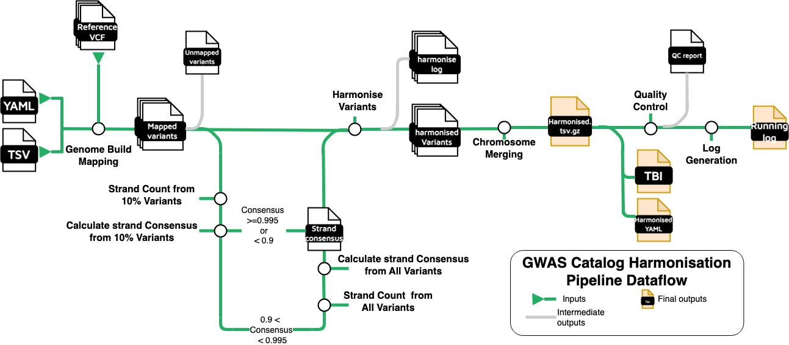

# Step-by-Step Process of the Harmonisation Pipeline


## Genome Build Mapping: 
The first step is lifting variants to the desired genome assembly (GRCh38). The pipeline employs the following methods, depending on data availability:
1. Mapping by rsID using Ensembl (v95): Whenever possible, the base pair location is updated by mapping the variant's rsID using the Ensembl database. If this method is successful, the field `hm_coordinate_conversion` is set to 'rs', indicating that the base pair location was derived from Ensembl’s reference variant database.
2. Liftover to the latest genome build: If the rsID mapping is not possible, the variant’s position is lifted over from the older genome build to GRCh38 using the tool LiftOver. In this case, the field `hm_coordinate_conversion` is set to 'lo', indicating that the base pair location was converted by lifting the coordinates.
3. Variant removal: If neither rsID mapping nor liftover is successful, the variant is removed from the file. This ensures that only high-confidence variants with validated genomic positions are retained in the final dataset.

This process is recorded in the `hm_coordinate_conversion` field in the harmonised data file to provide traceability for how each variant's genomic position was determined. 

## Inferring the orientation of palindromic variants
Palindromic variants are genetic variants (such as A/T or G/C SNPs) that appear identical on both the forward and reverse DNA strands, making it difficult to distinguish their true orientation. To ensure that these variants are correctly aligned during harmonisation, the pipeline employs a method to infer their strand orientation using a strand consensus approach.

The pipeline uses the following method to infer the orientation of palindromic variants:
1. Strand Count from 10% variants

* First, 10% of non-palindromic sites are randomly selected. For these sites, the alleles (both effect and other alleles) are compared with the reference and alternative alleles in the Ensembl VCF reference. This comparison helps determine whether the variants align with the forward strand (same as the reference) or the reverse strand (reverse complement of the reference).

2. Calculating strand consensus from 10% variants
* Based on this comparison, the forward strand consensus rate is calculated as either: forward/(forward + reverse), or reverse/(forward + reverse).

3. Inferring the strand of palindromic variants
* This rate indicates how often the variants align to the forward strand, providing a basis for inference about palindromic variant orientation. To minimize sampling bias, the following thresholds are applied:

  - If the consensus rate is ≥ 0.995
    - The palindromic variants are inferred to be aligned on the forward (or reverse) strand. The harmonisation proceeds accordingly for these variants.
  - If the consensus rate is between 0.995 and 0.9 
    - The consensus rate is recalculated using **ALL** non-palindromic variants in the dataset. If the recalculated rate is > 0.99, the palindromic variants are inferred to be aligned to the forward (or reverse) strand and harmonised accordingly. If the recalculated rate is ≤ 0.99, the palindromic variants are dropped from harmonisation to prevent errors.
  - If the consensus rate is ≤ 0.9
    - The palindromic variants are excluded from further harmonisation steps to ensure data integrity.

## Harmonising the variants with the reference
Each variant is harmonised by aligning it with a reference dataset - Ensembl VCF. The harmonisation process ensures allele consistency and corrects the orientation of alleles to the forward strand. This step ensures that all variants are aligned and ready for downstream analysis.

Query against the reference: Each variant is matched against the Ensembl VCF reference using its chromosome, base pair location, and alleles (effect allele and other allele). Based on this comparison, the following actions are taken:
1. Keeping the record as-is:
* If the variant is already correctly oriented according to the reference (i.e., both effect and other alleles match the reference forward strand), no changes are made, and the variant is kept as-is.
2. Orientating to the reference strand:
* If the alleles are oriented to the reverse strand, the pipeline reverse complements both the effect and other alleles to align them with the forward strand of the reference. This ensures that the variant is reported in the correct orientation.
3. Flipping the effect and other alleles:
* If the effect and other alleles are flipped compared to the reference, the pipeline flips the alleles accordingly. This flip means the effect allele and other allele are swapped to match the reference. Along with flipping the alleles, associated metrics such as beta, odds ratio (OR), Z-score, confidence interval (CI) for the odds ratio, and effect allele frequency (EAF) are inverted to reflect the change in allelic direction.
For flipped variants:

$$
I = \int_0^{2\pi} \sin(x)\,dx
$$

```math
\left( \sum_{k=1}^n a_k b_k \right)^2 \leq \left( \sum_{k=1}^n a_k^2 \right) \left( \sum_{k=1}^n b_k^2 \right)
Odds_ratio = 1/OR_orginal
Ci_upper=1/CI_lower_original
Ci_lower=1/CI_upper_original
Effect_allele_frequency = 1-EAF_original
```
4. Replacing with NA:
* If the variant cannot be found in the Ensembl VCF reference, indicating there is no counterpart for that variant, the record is replaced with NA. This prevents erroneous data from being included in the harmonised dataset. These variants will be removed during the Quality control step.


## Quality control
